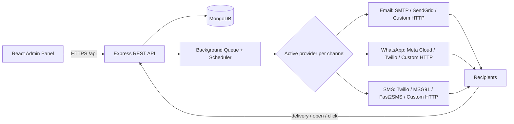

# Campaign Management System

A self-hosted, multi-tenant admin panel to run **bulk Email, WhatsApp and SMS campaigns** — with contact
management, reusable templates, surveys, delivery/open/click tracking, an approval workflow, support tickets and
per-account branding.

> Bulk messaging + surveys + analytics + support, all in one panel.

---

## Table of contents

- [Highlights](#highlights)
- [Live docs](#live-docs)
- [Architecture](#architecture)
- [Multi-tenant accounts](#multi-tenant-accounts)
- [Roles & permissions](#roles--permissions)
- [Features](#features)
- [Tech stack](#tech-stack)
- [Project structure](#project-structure)
- [Getting started](#getting-started)
- [Environment variables](#environment-variables)
- [Docker deployment](#docker-deployment)
- [Modules](#modules)
- [Channels & providers](#channels--providers)
- [Delivery webhooks](#delivery-webhooks)
- [Tracking & unsubscribe](#tracking--unsubscribe)
- [Email notifications](#email-notifications)
- [API overview](#api-overview)
- [Data models](#data-models)
- [Security](#security)
- [Production notes](#production-notes)

---

## Highlights

- **3 channels** — Email, WhatsApp and SMS from one campaign builder
- **Multi-tenant** — many independent accounts on one install, fully data-isolated
- **Queue engine** — background sending with concurrency, retries, send window and daily limits
- **Approval workflow** — managers submit, admins approve before anything is sent
- **Dynamic everything** — templates, categories, roles, themes and providers are all configurable from the panel
- **Tracking** — open pixel, click redirect, unsubscribe and delivery webhooks
- **Support tickets** — users raise tickets, admins reply/close, with email notifications
- **Branding** — upload a logo, set company details and a "Powered by" footer
- **6 colour themes** — switchable per account, settable per user
- **Import / export** — CSV & Excel for contacts and users, with example templates

---

## Live docs

The frontend ships two self-contained, printable pages (also linked from the sidebar):

| Page | URL |
| --- | --- |
| Product presentation (with SVG diagrams) | `http://localhost:5001/presentation.html` |
| Step-by-step user guide | `http://localhost:5001/guide.html` |

Both have a **Print / PDF** button.

---

## Architecture



- **React + Vite** admin panel (SPA) talks to the **Express** API over HTTPS.
- **MongoDB** stores accounts, contacts, campaigns, templates, surveys, tickets and settings.
- A **background queue** processes campaigns; a **scheduler** starts scheduled campaigns and auto-resumes paused ones.
- The queue dispatches to whichever provider each account has **activated**.

---

## Multi-tenant accounts

One install serves many independent accounts (tenants):

- **Super Admin** — sees everything: all admins, all users and all data. Creates admins.
- **Admin** — owns a tenant. Creates and manages its own sub-users and only ever sees its own contacts, lists,
  templates, campaigns, surveys, providers, tickets and reports.
- **Sub-users** (manager / viewer / custom roles) — belong to their admin's tenant and see the same data as their admin.

Rules:

- Only a **super admin** can create admins (and other super admins).
- An **admin** can create sub-users with any role except `admin` / `super_admin`.
- Every data document stores an `owner` (the tenant id). All queries are automatically scoped, so one account can
  never see another account's data.
- Provider settings, sending rules, branding and tickets are all per-tenant.

---

## Roles & permissions

Roles are managed on a separate **Roles** page. Four built-in roles are seeded (and cannot be deleted):

| Role | Permissions |
| --- | --- |
| `super_admin` | Everything, including managing roles and creating admins |
| `admin` | Own account: contacts, lists, templates, campaigns, approvals, surveys, users, settings, tickets |
| `manager` | Build campaigns/contacts/templates; sending requires approval |
| `viewer` | Read-only dashboard and reports |

Permission keys: `dashboard.view`, `contacts.manage`, `lists.manage`, `templates.manage`, `campaigns.manage`,
`campaigns.send`, `campaigns.approve`, `surveys.manage`, `reports.view`, `users.manage`, `roles.manage`,
`settings.manage`, `tickets.manage`.

Create any **custom role** with a chosen set of permissions and assign it to users. Changing a role instantly affects
every user with that role.

---

## Features

### Campaigns
- Build over Email / WhatsApp / SMS with `{{variables}}` personalisation
- Use a template or write inline; preview audience size before sending
- **Schedule** for later, or **send now**
- **Pause / Resume / Cancel** a running campaign
- **Test send** a single message before the bulk
- **Retry failed** recipients (plus automatic retries with backoff)
- **Approval workflow** for users without `campaigns.approve`
- **Export** the recipient report as CSV

### Contacts & lists
- Name, email, phone, WhatsApp, country code, tags and custom fields
- **CSV / Excel import & export** with a downloadable example
- Duplicate detection on email/phone
- **Lists** for audience segmentation; default country code configurable

### Templates & categories
- Email / WhatsApp / SMS templates with detected `{{variables}}`
- **Dynamic categories** you create yourself
- Optional HTML body for email (enables open/click tracking)

### Surveys
- Single, multiple, yes/no, rating and text questions
- Public self-hosted page (`/s/:slug`) — works without the SPA
- Attach a survey link to campaigns with per-recipient tracking
- Summary + responses view

### Tracking & analytics
- Open pixel, click redirect and unsubscribe
- Delivery / open / click stats per campaign
- Dashboard overview and an audit log of every action

### Support tickets
- Users raise tickets; admins see all tickets for their account
- Threaded replies, close / reopen
- Email notifications on create and reply

### Settings
- **Branding** — logo upload, company name/email/phone/website/address, "Powered by" footer
- **Appearance** — 6 colour themes
- **Providers** — Email / WhatsApp / SMS with test send (credentials encrypted)
- **Sending & contact rules** — time window, daily limit, timezone, default country code

---

## Tech stack

**Backend:** Node.js, Express, MongoDB + Mongoose, JWT, bcrypt, ExcelJS, csv-parse, Nodemailer, Axios
**Frontend:** React, Vite, React Router, Lucide icons, custom theme system
**Ops:** Docker + Compose, Nginx

---

## Project structure

```
election project/
├── backend/
│   ├── src/
│   │   ├── config/        env, db, themes
│   │   ├── controllers/   auth, user, role, contact, list, template, category,
│   │   │                  campaign, survey, setting, dashboard, ticket,
│   │   │                  tracking, webhook, publicPage
│   │   ├── middleware/    auth, permission, upload, error
│   │   ├── models/        User, Role, Contact, ContactList, Template,
│   │   │                  TemplateCategory, Campaign, CampaignRecipient,
│   │   │                  ProviderSetting, Survey, SurveyResponse, Ticket,
│   │   │                  TrackingEvent, AuditLog, AppSetting
│   │   ├── routes/        one router per module + index
│   │   ├── services/      queue, scheduler, audience, providerService,
│   │   │                  deliveryStatus, notify, permissions,
│   │   │                  providers/{email,whatsapp,sms,customHttp}
│   │   ├── utils/         scope, crypto, render, logger, audit, asyncHandler
│   │   ├── scripts/       seed
│   │   └── server.js
│   ├── Dockerfile
│   └── .env.example
├── frontend/
│   ├── public/            presentation.html, guide.html
│   ├── src/
│   │   ├── components/    Layout, Icon, LiveClock, ui
│   │   ├── lib/           api, auth, toast, theme, constants
│   │   ├── pages/         Login, Dashboard, Contacts, Lists, Templates,
│   │   │                  Campaigns, CampaignDetail, Surveys, SurveyDetail,
│   │   │                  Reports, Roles, Users, Support, Settings, Profile
│   │   └── styles.css
│   ├── Dockerfile
│   └── nginx.conf
└── docker-compose.yml
```

---

## Getting started

### 1. Backend

```bash
cd backend
cp .env.example .env      # then edit the values
npm install
npm run seed              # creates the super admin + system roles
npm run dev               # http://localhost:5000
```

### 2. Frontend

```bash
cd frontend
npm install
npm run dev               # http://localhost:5001
```

Vite proxies `/api`, `/uploads`, `/t` and `/s` to the backend on port `5000`.

**Default login:** `admin@example.com` / `Admin@12345` (from `.env` — change it).

---

## Environment variables

| Variable | Description | Default |
| --- | --- | --- |
| `PORT` | Backend port | `5000` |
| `NODE_ENV` | Environment | `development` |
| `PUBLIC_BASE_URL` | Public backend URL used in links | `http://localhost:5000` |
| `MONGO_URI` | MongoDB connection string | `mongodb://127.0.0.1:27017/campaign_db` |
| `JWT_SECRET` | JWT signing secret | — |
| `JWT_EXPIRES_IN` | Token lifetime | `7d` |
| `SETTINGS_ENCRYPTION_KEY` | Key to encrypt provider credentials | — |
| `CORS_ORIGIN` | Allowed origins (comma separated) | `http://localhost:5001` |
| `SUPER_ADMIN_NAME/EMAIL/PASSWORD` | Seed super admin | — |
| `SEND_DELAY_MS` | Delay between sends (rate limit) | `250` |
| `MAX_CONCURRENT_CAMPAIGNS` | Campaigns processed at once | `2` |
| `MAX_SEND_RETRIES` | Retries per message | `2` |
| `RETRY_BACKOFF_MS` | Backoff between retries | `3000` |
| `SCHEDULER_INTERVAL_MS` | Scheduler tick interval | `30000` |

---

## Docker deployment

```bash
# from the project root
export JWT_SECRET="a-long-random-secret"
export SETTINGS_ENCRYPTION_KEY="another-long-random-key"
export PUBLIC_BASE_URL="http://your-domain"
export CORS_ORIGIN="http://your-domain"

docker compose up -d --build
docker compose exec backend npm run seed
```

- Admin panel: `http://localhost:8080`
- Backend API: `http://localhost:5000`

---

## Modules

### Dashboard
Overview cards (contacts, lists, campaigns, templates, surveys, responses, users), message delivery stats and
recent campaigns — all scoped to the account.

### Contacts
Add contacts manually or import from CSV/Excel. Export CSV/Excel. Tags, custom fields, lists and a configurable
default country code. Duplicates are rejected.

### Contact lists
Group contacts for targeted campaigns. Campaigns can target one or more lists.

### Templates & categories
Reusable Email / WhatsApp / SMS templates with `{{name}}`, `{{survey_link}}`, `{{unsubscribe_link}}` and custom-field
variables. Categories are fully dynamic — add or remove them from the template form.

### Campaigns
Create, schedule and send campaigns. The campaign page shows live stats, recipients, test send, retry, export, and
the approval controls.

### Surveys
Build feedback forms, publish a public link, attach to campaigns, and view summary results and responses.

### Reports & audit
Audit log of all actions with filters. Per-campaign delivery/open/click stats.

### Roles & Users
Separate pages. Create roles with permissions, then assign a role (and optional extra permissions) to users.
Users support CSV/Excel import and export plus an example template.

### Support tickets
Users raise tickets; admins manage, reply and close. Email notifications both ways.

### Settings
Branding, appearance (themes), providers and sending/contact rules.

---

## Channels & providers

| Channel | Providers |
| --- | --- |
| Email | SMTP, SendGrid, Custom HTTP API |
| WhatsApp | Meta Cloud API, Twilio, Custom HTTP API |
| SMS | Twilio, MSG91, Fast2SMS, Custom HTTP API |

Add a provider, click **Set active** (only one active per channel), then **Test**. Credentials are stored encrypted
(AES-256-GCM).

**Custom HTTP provider** — plug in any third-party API with a URL, method, headers and a body template using
`{{to}}`, `{{message}}`, `{{subject}}`, `{{name}}` placeholders.

---

## Delivery webhooks

Point your provider's status callback to:

| Provider | URL |
| --- | --- |
| Meta WhatsApp Cloud | `POST {PUBLIC_BASE_URL}/api/webhooks/meta` (verify: `GET` with `hub.verify_token`) |
| Twilio (SMS/WhatsApp) | `POST {PUBLIC_BASE_URL}/api/webhooks/twilio` |
| Custom HTTP | `POST {PUBLIC_BASE_URL}/api/webhooks/custom` |

For Meta, set a **Webhook Verify Token** in the provider config. For custom providers, optionally set a
**Webhook token** and include it as `token` in the callback body:

```json
{ "providerMessageId": "abc123", "status": "delivered", "token": "shared-secret" }
```

---

## Tracking & unsubscribe

- **Open pixel** — `GET /t/open/:trackingId.gif` (embedded in HTML emails)
- **Click redirect** — `GET /t/click/:trackingId?url=...` (wraps links in HTML emails)
- **Unsubscribe** — `GET /t/unsubscribe/:trackingId` (marks the contact unsubscribed)
- Email also sends the `List-Unsubscribe` and `List-Unsubscribe-Post` headers

---

## Email notifications

Using the account's active **Email** provider:

- A **new user** receives their login credentials by email
- The **company email** is notified when a ticket is raised
- The other party is notified on every ticket reply

---

## API overview

All routes are prefixed with `/api` and require `Authorization: Bearer <token>` (except public routes).

| Group | Base path |
| --- | --- |
| Auth | `/api/auth` (`login`, `me`, `change-password`, `theme`) |
| Users | `/api/users` (+ `import`, `export`, `template`) |
| Roles | `/api/roles` |
| Contacts | `/api/contacts` (+ `import`, `export`, `template`, `defaults`, `tags`) |
| Lists | `/api/lists` |
| Templates | `/api/templates` |
| Categories | `/api/categories` |
| Campaigns | `/api/campaigns` (+ `send`, `pause`, `resume`, `cancel`, `test`, `retry-failed`, `recipients`, `stats`, `approve`, `reject`, `request-approval`) |
| Surveys | `/api/surveys` (+ `results`) |
| Settings | `/api/settings` (`providers`, `branding`, `sending-rules`, `meta`) |
| Branding | `/api/branding` |
| Tickets | `/api/tickets` (+ `mine`, `stats`, `:id/reply`, `:id/close`, `:id/reopen`) |
| Dashboard | `/api/dashboard` (`overview`, `audit-logs`) |
| Public | `/api/public/surveys/:slug` (+ `/submit`) |
| Webhooks | `/api/webhooks/{meta,twilio,custom}` |
| Tracking | `/t/{open,click,unsubscribe}/:id` |
| Survey page | `/s/:slug` |
| Uploads | `/uploads/*` |

---

## Data models

`User`, `Role`, `Contact`, `ContactList`, `Template`, `TemplateCategory`, `Campaign`, `CampaignRecipient`,
`ProviderSetting`, `Survey`, `SurveyResponse`, `Ticket`, `TrackingEvent`, `AuditLog`, `AppSetting`.

---

## Security

- JWT authentication on every request; bcrypt password hashing
- Role + permission checks on every route
- Provider secrets encrypted at rest (AES-256-GCM)
- Rate limiting on login and public submissions
- Multi-tenant data isolation by `owner`
- Helmet, CORS, mongo-sanitize and hpp middleware
- Audit log of actions

---

## Production notes

- **Change `JWT_SECRET`, `SETTINGS_ENCRYPTION_KEY` and the super admin password before going live.**
- The send queue is in-process (concurrency + retries). For very high volume, move it to Redis + BullMQ — the
  queue is isolated in `backend/src/services/queue.js`.
- Tune `SEND_DELAY_MS`, `MAX_CONCURRENT_CAMPAIGNS`, `MAX_SEND_RETRIES` and `RETRY_BACKOFF_MS` for your provider limits.
- Keep `backend/uploads/` writable (logos) and back it up.
- Set `PUBLIC_BASE_URL` to your public domain so survey/tracking links work.

---

## License

ISC
